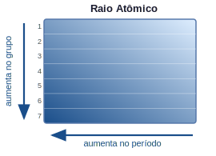
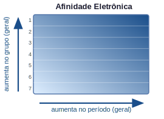
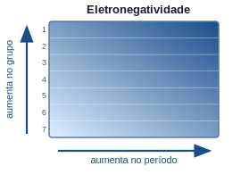

# Química Geral — Propriedades Periódicas

### Da configuração eletrônica às tendências da tabela periódica

---

###  1 — Motivação

> "Por que o sódio reage violentamente com água enquanto o cloro é um gás tóxico, mas ambos juntos formam o sal de cozinha?"

- Para **prever reações** → precisamos entender por que certos elementos perdem ou ganham elétrons com facilidade
- Para **projetar materiais** → propriedades como dureza, condutividade e reatividade variam sistematicamente na tabela
- Para **interpretar a tabela periódica** → ela não é apenas uma lista, mas um **mapa de tendências**

> As propriedades periódicas emergem diretamente da configuração eletrônica: ao atravessar a tabela, a estrutura eletrônica varia de forma sistemática — e as propriedades acompanham essa variação.

---

###  2 — Lei Periódica

A tabela periódica moderna é baseada na **Lei Periódica de Moseley** (1913):

> "As propriedades dos elementos são funções periódicas do seu **número atômico** $Z$."

**Contexto histórico:**

| Cientista | Ano | Contribuição |
|-----------|-----|-------------|
| Döbereiner | 1829 | Tríades: agrupamentos de 3 elementos com propriedades semelhantes |
| Newlands | 1864 | Lei das Oitavas: periodicidade a cada 8 elementos |
| Mendeleev | 1869 | Tabela organizada por massa atômica; previu elementos não descobertos |
| Moseley | 1913 | Reorganização por número atômico $Z$ (não massa) — corrigiu inversões |

**Por que $Z$ e não a massa?**

A massa atômica inclui os nêutrons, que não participam das interações químicas. É o número de prótons ($Z$) que determina a estrutura eletrônica e, portanto, as propriedades.

> **Exceção histórica resolvida:** Te ($Z=52$, massa 127,6) vinha antes de I ($Z=53$, massa 126,9) na tabela de Mendeleev — inversão corrigida pela ordenação por $Z$.

---

###  3 — Organização da Tabela Periódica

**Períodos (linhas horizontais):** elementos no mesmo período possuem o mesmo número de camadas eletrônicas ocupadas (mesmo $n$ máximo).

| Período | $n$ máximo | Elementos | Subníveis preenchidos |
|---------|-----------|-----------|----------------------|
| 1 | 1 | H, He | 1s |
| 2 | 2 | Li → Ne | 2s, 2p |
| 3 | 3 | Na → Ar | 3s, 3p |
| 4 | 4 | K → Kr | 4s, 3d, 4p |
| 5 | 5 | Rb → Xe | 5s, 4d, 5p |
| 6 | 6 | Cs → Rn | 6s, 4f, 5d, 6p |
| 7 | 7 | Fr → Og | 7s, 5f, 6d, 7p |

**Grupos (colunas verticais):** elementos no mesmo grupo possuem o mesmo número de **elétrons de valência** e, portanto, propriedades químicas semelhantes.

| Grupo (IUPAC) | Grupo (antigo) | Nome | Config. de valência |
|---------------|----------------|------|---------------------|
| 1 | IA | Metais alcalinos (exceto H) | $ns^1$ |
| 2 | IIA | Metais alcalino-terrosos | $ns^2$ |
| 3–12 | — | Metais de transição | $ns^{1-2}(n{-}1)d^{1-10}$ |
| 13 | IIIA | Grupo do boro | $ns^2 np^1$ |
| 14 | IVA | Grupo do carbono | $ns^2 np^2$ |
| 15 | VA | Grupo do nitrogênio | $ns^2 np^3$ |
| 16 | VIA | Calcogênios | $ns^2 np^4$ |
| 17 | VIIA | Halogênios | $ns^2 np^5$ |
| 18 | VIIIA | Gases nobres | $ns^2 np^6$ |

---

###  4 — Carga Nuclear Efetiva

Para entender as propriedades periódicas, é fundamental o conceito de **carga nuclear efetiva** $Z_{\text{ef}}$:

$$Z_{\text{ef}} = Z - \sigma$$

onde $Z$ é o número atômico e $\sigma$ é a **constante de blindagem** (shielding), que representa o quanto os elétrons internos "bloqueiam" a atração do núcleo sobre os elétrons de valência.

```
         Núcleo (+Z)
            |
  Elétrons internos (blindagem σ)
            |
  Elétrons de valência "sentem" Z_ef = Z - σ
```

**Tendências de $Z_{\text{ef}}$:**

- **No período (esquerda → direita):** $Z$ aumenta, mas $\sigma$ aumenta pouco (elétrons no mesmo nível blindam mal uns aos outros) → $Z_{\text{ef}}$ **aumenta**
- **No grupo (cima → baixo):** $Z$ aumenta, mas $\sigma$ aumenta proporcionalmente (novas camadas internas) → $Z_{\text{ef}}$ aproximadamente constante

> Exemplo: Na série Li → Ne (período 2), $Z_{\text{ef}}$ cresce de ~1,3 (Li) até ~5,8 (F), pois cada próton adicionado não é totalmente blindado pelos elétrons adicionados no mesmo subnível 2p.

---

###  5 — Raio Atômico



O raio atômico é medido como a **metade da distância entre núcleos** de dois átomos iguais ligados covalentemente (ou metálicamente).

**Tendências:**

```
         Raio atômico

         ← diminui no período →

    Li   Be   B    C    N    O    F    Ne
   152  112   87   77   75   73   72   --  (pm)

   aumenta
   no grupo
   ↓

   Na   Mg   Al   Si   P    S    Cl   Ar
   186  160  143  118  110  103   99   --  (pm)
```

| Direção | Tendência | Razão |
|---------|-----------|-------|
| Período (→) | Raio **diminui** | $Z_{\text{ef}}$ aumenta → maior atração nuclear → elétrons mais próximos |
| Grupo (↓) | Raio **aumenta** | Nova camada eletrônica → elétrons de valência mais afastados do núcleo |

**Raio iônico vs. raio atômico:**

| Espécie | Raio (pm) | Comparação |
|---------|-----------|------------|
| Na | 186 | Átomo neutro |
| Na⁺ | 102 | Menor: perdeu a camada 3s; $Z_{\text{ef}}$ sobre as camadas restantes aumenta |
| Cl | 99 | Átomo neutro |
| Cl⁻ | 181 | Maior: ganhou elétron; maior repulsão eletrônica, $Z_{\text{ef}}$ "diluída" |

> **Cátions** são menores que o átomo neutro; **ânions** são maiores.

---

###  6 — Energia de Ionização


A **energia de ionização** (EI) é a energia mínima necessária para remover um elétron de um átomo gasoso em estado fundamental:

$$\text{X}(g) \longrightarrow \text{X}^+(g) + e^- \qquad \Delta H = \text{EI}_1 > 0$$

É sempre **endotérmica** (requer energia).

**Tendências:**

| Direção | Tendência | Razão |
|---------|-----------|-------|
| Período (→) | EI **aumenta** | $Z_{\text{ef}}$ maior → elétron mais fortemente retido |
| Grupo (↓) | EI **diminui** | Elétron de valência mais afastado e mais blindado → mais fácil de remover |

**Valores de EI₁ no período 2 (kJ/mol):**

| Li | Be | B | C | N | O | F | Ne |
|----|----|---|---|---|---|---|-----|
| 520 | 899 | 800 | 1086 | 1402 | 1314 | 1681 | 2081 |

> **Irregularidades:** Be > B e N > O. Por quê?
> - **B:** perde elétron do 2p (menos estável que 2s do Be) → EI menor
> - **O:** perde um elétron do par emparelhado do 2p → repulsão elétron-elétron facilita a remoção

**Energias de ionização sucessivas:**

Cada elétron removido aumenta o $Z_{\text{ef}}$ percebido pelos elétrons restantes. Há um **salto brusco** quando se começa a retirar elétrons de uma camada mais interna:

| Espécie | EI₁ | EI₂ | EI₃ | EI₄ |
|---------|-----|-----|-----|-----|
| Na (grupo 1) | 496 | **4562** | — | — |
| Mg (grupo 2) | 738 | 1451 | **7733** | — |
| Al (grupo 13) | 578 | 1817 | 2745 | **11578** |

> O salto revela o número de elétrons de valência: Na tem 1, Mg tem 2, Al tem 3.

---

###  7 — Afinidade Eletrônica



A **afinidade eletrônica** (AE) é a variação de energia quando um átomo neutro gasoso **ganha** um elétron:

$$\text{X}(g) + e^- \longrightarrow \text{X}^-(g) \qquad \Delta H = -\text{AE}$$

Convenção: AE **positiva** indica que a adição de elétron é **exotérmica** (o átomo "deseja" o elétron).

**Tendências gerais:**

| Direção | Tendência | Razão |
|---------|-----------|-------|
| Período (→) | AE tende a **aumentar** | $Z_{\text{ef}}$ maior atrai o elétron entrante mais fortemente |
| Grupo (↓) | AE tende a **diminuir** | Elétron entra numa camada mais afastada, menos atraída |

**Valores de AE (kJ/mol) — período 3:**

| Na | Mg | Al | Si | P | S | Cl | Ar |
|----|----|----|----|----|---|----|----|
| 53 | −40 | 42 | 134 | 72 | 200 | 349 | −35 |

> **Halogênios** possuem as maiores afinidades eletrônicas — falta apenas 1 elétron para completar o octeto.
> **Gases nobres** têm AE negativa — o elétron entraria numa nova camada (n+1), energeticamente desfavorável.
> **Mg e Be** têm AE negativa — camada s completa ($ns^2$) oferece resistência extra.

---

###  8 — Eletronegatividade



A **eletronegatividade** (EN, escala de Pauling) mede a tendência de um átomo em **atrair elétrons** dentro de uma ligação química:

$$\chi_{\text{Pauling}}: \quad \text{F} = 4{,}0 \text{ (maior)} \quad \longleftrightarrow \quad \text{Cs} = 0{,}7 \text{ (menor)}$$

**Tendências (escala de Pauling):**

```
         Eletronegatividade

         ← aumenta no período →

    Li   Be   B    C    N    O    F
    1.0  1.5  2.0  2.5  3.0  3.5  4.0

   diminui
   no grupo
   ↓

   Na   Mg   Al   Si   P    S    Cl
   0.9  1.2  1.5  1.8  2.1  2.5  3.0
```

| Direção | Tendência | Razão |
|---------|-----------|-------|
| Período (→) | EN **aumenta** | Maior $Z_{\text{ef}}$ atrai mais fortemente os elétrons de ligação |
| Grupo (↓) | EN **diminui** | Elétrons de valência mais afastados do núcleo |

**Diferença de eletronegatividade e tipo de ligação:**

| $\Delta \chi$ | Tipo de ligação | Exemplo |
|--------------|-----------------|---------|
| $< 0{,}5$ | Covalente apolar | $\text{H}_2$, $\text{Cl}_2$ |
| $0{,}5$ – $1{,}7$ | Covalente polar | $\text{HCl}$, $\text{H}_2\text{O}$ |
| $> 1{,}7$ | Iônica | $\text{NaCl}$ ($\Delta\chi = 2{,}1$) |

---

###  9 — Comparativo das Propriedades Periódicas

```
         Período (→)    Grupo (↓)
         ─────────────  ─────────────
Raio     diminui        aumenta
EI       aumenta        diminui
AE       aumenta (geral) diminui (geral)
EN       aumenta        diminui
```

**Resumo em um diagrama:**

```
                  ← Período →          Grupo
                                          ↓
  Raio atômico     grande ─────► pequeno  pequeno ─► grande
  EI               baixa  ─────► alta     alta    ─► baixa
  EN               baixa  ─────► alta     alta    ─► baixa
  Caráter metálico alto   ─────► baixo    baixo   ─► alto
```

---

###  10 — Metais, Não-Metais e Metaloides

A tabela periódica divide os elementos em três grandes classes com base em suas propriedades físicas e químicas:

**Metais (lado esquerdo e centro):**
- Condutores elétricos e térmicos
- Brilho metálico, maleáveis, dúcteis
- Sólidos a temperatura ambiente (exceto Hg)
- Tendência a **perder** elétrons (baixa EI, baixa EN)
- Exemplos: Fe, Cu, Al, Na, Ca, Au

**Não-metais (lado superior direito):**
- Isolantes elétricos (exceto grafite)
- Sólidos frágeis, líquidos ou gases
- Tendência a **ganhar** elétrons (alta EI, alta EN)
- Exemplos: C, N, O, F, Cl, S, P, H

**Metaloides (semimetais — fronteira):**
- Propriedades intermediárias
- Semicondutores (fundamental para a eletrônica)
- Posição: diagonal B, Si, Ge, As, Sb, Te, (At)
- Exemplo: Si ($[\text{Ne}]\ 3s^2\ 3p^2$) — base dos transistores

```
    H                                                   He
    Li  Be                          B   C   N   O   F   Ne
    Na  Mg                          Al  Si  P   S   Cl  Ar
    K   Ca  Sc  Ti  V  Cr Mn Fe Co Ni Cu Zn  Ga  Ge  As  Se  Br  Kr
    ...

    Metais    Metaloides   Não-metais
    (esq.)    (diagonal)   (dir. superior)
```

---

###  11 — Tendências nas Famílias Principais

#### Metais Alcalinos (Grupo 1): Li, Na, K, Rb, Cs, Fr

- Configuração: $ns^1$
- Perdem facilmente 1 elétron → cátions $M^+$
- Reagem vigorosamente com água: $2M + 2H_2O \rightarrow 2MOH + H_2\uparrow$
- A reatividade **aumenta** ao descer o grupo (EI diminui)
- Li reage lentamente; K reage com ignição; Cs explode

| Metal | EI₁ (kJ/mol) | Raio (pm) | Reatividade com H₂O |
|-------|-------------|-----------|---------------------|
| Li | 520 | 152 | Lenta, sem chama |
| Na | 496 | 186 | Vigorosa, chama amarela |
| K | 419 | 227 | Muito vigorosa, chama lilás |
| Rb | 403 | 248 | Explosiva |
| Cs | 376 | 265 | Extremamente explosiva |

#### Metais Alcalino-Terrosos (Grupo 2): Be, Mg, Ca, Sr, Ba, Ra

- Configuração: $ns^2$
- Perdem 2 elétrons → cátions $M^{2+}$
- Menos reativos que os alcalinos (EI maior)
- Be é praticamente inerte; Ca reage com H₂O; Ba reage vigorosamente
- Importantes biologicamente: Ca (ossos, dentes), Mg (clorofila)

| Metal | EI₁ (kJ/mol) | EI₂ (kJ/mol) | Aplicação |
|-------|-------------|-------------|----------|
| Be | 899 | 1757 | Ligas leves, janelas de raios-X |
| Mg | 738 | 1451 | Ligas de alumínio, fogos de artifício |
| Ca | 590 | 1145 | Ossos, cal, cimento |
| Ba | 503 | 965 | Sulfato: contraste de raios-X |

#### Halogênios (Grupo 17): F, Cl, Br, I, At

- Configuração: $ns^2 np^5$ — faltam apenas 1 elétron para o octeto
- Maior afinidade eletrônica da tabela → formam ânions $X^-$
- Muito eletronegativos; oxidantes poderosos
- A reatividade **diminui** ao descer o grupo

| Halogênio | Estado (25°C) | Cor | AE (kJ/mol) | EN (Pauling) |
|-----------|---------------|-----|-------------|--------------|
| F | Gás | Amarelo-pálido | 328 | 4,0 |
| Cl | Gás | Verde-amarelo | 349 | 3,0 |
| Br | Líquido | Vermelho-marrom | 325 | 2,8 |
| I | Sólido | Violeta-escuro | 295 | 2,5 |

> **Paradoxo do F vs. Cl:** Cl tem AE maior que F! O flúor tem raio tão pequeno que há repulsão extra entre o elétron entrante e os elétrons já presentes no átomo compacto.

#### Gases Nobres (Grupo 18): He, Ne, Ar, Kr, Xe, Rn

- Configuração: $ns^2 np^6$ (He: $1s^2$) — octeto completo
- Extremamente inertes: EI muito alta, AE negativa
- Não formam compostos em condições normais
- Xe e Kr podem formar compostos com F e O sob condições extremas (ex.: $\text{XeF}_4$)

| Gás nobre | EI₁ (kJ/mol) | Aplicação |
|-----------|-------------|-----------|
| He | 2372 | Balões, resfriamento de MRI |
| Ne | 2081 | Letreiros luminosos (luz vermelha) |
| Ar | 1521 | Atmosfera de solda, lâmpadas |
| Kr | 1351 | Lasers, fotografia de alta velocidade |
| Xe | 1170 | Holofotes, anestésico experimental |

---

###  12 — Aplicações em Engenharia

| Área | Propriedade periódica envolvida | Exemplo |
|------|--------------------------------|---------|
| Semicondutores | EN, raio atômico | Si e Ge: dopagem com P (grupo 15) ou B (grupo 13) |
| Baterias | EI baixa (fácil perda de e⁻) | Li (grupo 1): leve, alta EI relativa → baterias de Li-íon |
| Corrosão | EN, EI | Al forma óxido protetor (alta EN do O); Fe enferruja |
| Catálise | Múltiplos estados de oxidação | Metais de transição (Pt, Pd) — EI intermediária |
| Medicamentos | Raio iônico, EN | Complexos de Pt (cisplatina): antitumoral |
| Ligas metálicas | Raio atômico compatível | Aço: Fe + C (raio menor → ocupa interstícios) |

---

###  13 — Mapa Conceitual da Aula

```
           NÚMERO ATÔMICO Z
                  │
       CONFIGURAÇÃO ELETRÔNICA
                  │
         CARGA NUCLEAR EFETIVA (Z_ef)
                  │
    ┌─────────────┼─────────────┐
    │             │             │
RAIO        ENERGIA DE      ELETRO-
ATÔMICO     IONIZAÇÃO       NEGATIVIDADE
    │             │             │
    └─────────────┼─────────────┘
                  │
           AFINIDADE
           ELETRÔNICA
                  │
    ┌─────────────┴─────────────┐
    │                           │
CARÁTER                   TIPO DE
METÁLICO                  LIGAÇÃO
    │                           │
    ▼                           ▼
FAMÍLIAS                 IÔNICA / COVALENTE
(alcalinos,              (polar ou apolar)
 halogênios...)
```

---

###  14 — Resumo e Conexões

| Propriedade | Definição | Tendência no período (→) | Tendência no grupo (↓) |
|-------------|-----------|--------------------------|------------------------|
| Raio atômico | Metade da distância internuclear | Diminui | Aumenta |
| Energia de ionização | Energia para remover 1 e⁻ | Aumenta | Diminui |
| Afinidade eletrônica | Energia ao ganhar 1 e⁻ | Aumenta (geral) | Diminui (geral) |
| Eletronegatividade | Tendência a atrair e⁻ em ligação | Aumenta | Diminui |
| Caráter metálico | Facilidade de perder e⁻ | Diminui | Aumenta |

---

###  15 — Exercícios Propostos

**1.** A energia de ionização do oxigênio (O, $Z=8$) é **menor** que a do nitrogênio (N, $Z=7$), embora O tenha maior $Z$.
   - (a) Explique essa anomalia com base nas configurações eletrônicas do N e do O.
   - (b) O mesmo raciocínio explica por que a EI do berílio (Be) é maior que a do boro (B). Justifique.

**2.** Ordene os seguintes átomos em ordem crescente de raio atômico: Na, Mg, Al, Si, Cl. Justifique com base nas tendências periódicas.

**3.** O flúor (F) e o cloro (Cl) são halogênios do grupo 17.
   - (a) Compare os raios atômicos, energias de ionização e eletronegatividades de F e Cl.
   - (b) Apesar de o Cl ter maior afinidade eletrônica que o F, o F é considerado o oxidante mais forte. Explique essa aparente contradição.

**4.** Usando as energias de ionização sucessivas abaixo, determine o grupo da tabela periódica ao qual pertence o elemento X. Justifique.

| EI₁ | EI₂ | EI₃ | EI₄ | EI₅ |
|-----|-----|-----|-----|-----|
| 786 | 1577 | 3232 | 4356 | 16091 |

**5.** Classifique cada par abaixo como metal, não-metal ou metaloide, e indique qual tem maior eletronegatividade:
   - (a) Na e Cl
   - (b) Si e C
   - (c) Fe e S

---

###  16 — Gabarito dos Exercícios

**1.**
- (a) N: $[\text{He}]\ 2s^2\ 2p^3$ — três elétrons em 2p, um em cada orbital (Hund) → estabilidade extra do subnível semi-preenchido. O: $[\text{He}]\ 2s^2\ 2p^4$ — um dos orbitais 2p tem par de elétrons → repulsão entre eles facilita a remoção. Por isso EI(O) < EI(N).
- (b) Be: $[\text{He}]\ 2s^2$ — subnível 2s completo, mais estável. B: $[\text{He}]\ 2s^2\ 2p^1$ — elétron no 2p, mais energético e menos blindado. EI(Be) > EI(B).

**2.** Todos estão no 3º período. Raio diminui da esquerda para a direita pois $Z_{\text{ef}}$ aumenta. Ordem crescente: Cl < Si < Al < Mg < Na.

**3.**
- (a) F tem raio menor (64 pm < 99 pm), EI maior (1681 > 1251 kJ/mol) e EN maior (4,0 > 3,0) que Cl — tendências esperadas ao subir no grupo 17.
- (b) A AE mede a energia ao adicionar um elétron ao átomo **isolado**. O F, por ser muito pequeno, sofre repulsão extra dos elétrons já presentes → AE um pouco menor. Mas em reações de oxidação, o que importa é a energia total do processo (incluindo a ligação F–F fraca e a alta energia da ligação H–F), o que torna o F o oxidante mais forte em termos termodinâmicos globais.

**4.** O salto brusco ocorre entre EI₄ (4356) e EI₅ (16091 kJ/mol) → o 5º elétron a ser removido pertence a uma camada interna. Portanto, o elemento tem **4 elétrons de valência** → **Grupo 14** (ex.: Si, C, Ge).

**5.**
- (a) Na: metal (grupo 1). Cl: não-metal (grupo 17). Cl tem maior EN (3,0 vs. 0,9).
- (b) Si: metaloide (grupo 14). C: não-metal (grupo 14). C tem maior EN (2,5 vs. 1,8).
- (c) Fe: metal de transição. S: não-metal (grupo 16). S tem maior EN (2,5 vs. 1,8).

---

*Fim da aula — QG101 | Química Geral*

---

[Folha de exercícios (PDF)](assets/exercicios/aula5.pdf)
